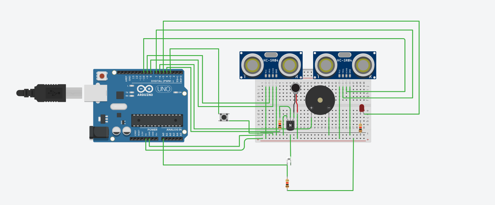

# 🦯 Smart Blind Stick – Arduino-Based Assistive System

A C++/Arduino project for an embedded smart cane system designed to **assist visually impaired individuals** by detecting obstacles and changes in terrain. The system uses **ultrasonic sensors**, a **light sensor**, and **multimodal feedback** (vibration, sound, and light) to enhance navigation autonomy and safety.

---

## 🚀 Project Objectives

- Help visually impaired users detect nearby **obstacles** and **height differences** (stairs, sidewalks).
- Offer **real-time alerts** via vibration, sound, and light.
- Evaluate **ambient brightness** on demand to support users sensitive to light conditions.

---

## 🔧 How It Works

The smart stick is powered by an **Arduino microcontroller** and uses the following logic:

### 1. **Obstacle Detection**
- **Two HC-SR04 ultrasonic sensors**:
  - One horizontal: detects obstacles in front.
  - One vertical: detects drops or steps below.
- Distance thresholds define alert levels (3 intensity levels).

### 2. **Light Detection**
- A **photoresistor (light sensor)** reads ambient light when the **push button** is pressed.
- If lighting is below a defined threshold, the user receives a **vibration pulse**.

### 3. **Feedback System**
- **Vibration motor**: Haptic feedback.
- **Buzzer**: Audio alert (1kHz or 2kHz depending on danger level).
- **LED**: Visual alert for detected obstacles.

---

## 🧱 Hardware Components

### 🔌 Sensors
- 2x **HC-SR04 Ultrasonic Sensors**  
- 1x **Photoresistor (Light Sensor)**
- 1x **Push Button**

### 📢 Actuators
- 1x **Vibration Motor**
- 1x **Buzzer**
- 1x **LED**

### ⚙️ Other
- Arduino Uno or Nano
- Power source (Battery pack or USB)
- Breadboard, resistors, jumpers

---

## 💡 Features

- Multilevel alert system:
  - **Level 1**: Mild feedback for low-risk detection
  - **Level 2**: Moderate feedback
  - **Level 3**: Strong and continuous feedback
- Light analysis triggered manually
- Embedded design using **TinkerCAD simulation** and real Arduino deployment

---
## 🖼️ System Overview

Below is an image of the actual Smart Blind Stick system:

